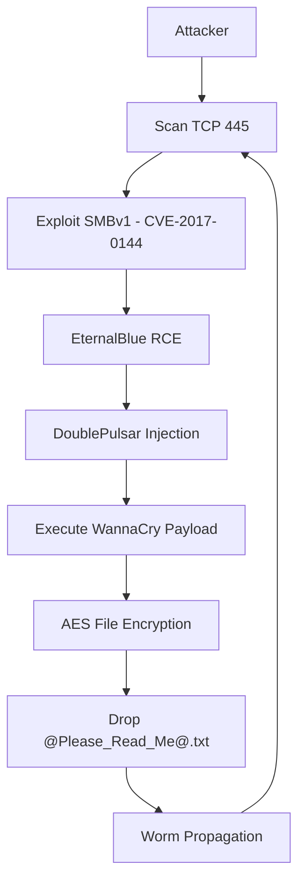

## 🧭 WannaCry Attack Flow Diagram

## 🧭 WannaCry Attack Flow — Beginner Explanation

This section explains the attack flow diagram in simple terms for beginners.

---

### 🔹 1️⃣ [ Attacker ]

This does not necessarily mean one person manually attacking.

It can be:
- A computer already infected
- An attacker-controlled machine

Once one machine is infected, it becomes the “attacker” for other machines.

This is how worms spread automatically.

---

### 🔹 2️⃣ [ Scan TCP 445 ]

Port **445** is used for:

- Windows file sharing
- SMB protocol (Server Message Block)

You can think of a port like a **door number** on a building.

If port 445 is open, it means:
> "This computer allows file sharing connections."

WannaCry scans networks and the internet looking for systems with this port open.

---

### 🔹 3️⃣ [ Exploit SMBv1 (CVE-2017-0144) ]

SMBv1 had a security vulnerability:

- **CVE-2017-0144**
- Exploit name: EternalBlue

CVE stands for **Common Vulnerabilities and Exposures**.  
It is simply a unique ID assigned to known security flaws.

This vulnerability allowed attackers to send specially crafted network packets and gain control of the system.

No password was required.  
No user interaction was needed.

---

### 🔹 4️⃣ [ EternalBlue RCE ]

RCE = **Remote Code Execution**

This means:
> An attacker can run commands on a computer from a remote location.

It is one of the most severe types of vulnerabilities.

Through EternalBlue, the attacker gained SYSTEM-level access.

---

### 🔹 5️⃣ [ DoublePulsar Injection ]

After gaining access, the attacker installed:

- **DoublePulsar** (a backdoor implant)

This acted like a hidden remote control inside the system.

It allowed the ransomware payload to be injected and executed properly.

---

### 🔹 6️⃣ [ Execute WannaCry Payload ]

Now the actual ransomware program runs.

At this stage:
- The malware prepares encryption
- Persistence mechanisms may be created
- The infection becomes active

---

### 🔹 7️⃣ [ AES File Encryption ]

This is where the real damage occurs.

WannaCry:

- Generates a unique AES encryption key
- Encrypts user files with AES
- Protects the AES key using RSA-2048 encryption

Why both?

- AES = Fast file encryption
- RSA = Protects the encryption key

Without the RSA private key (held by the attacker), decryption is nearly impossible.

---

### 🔹 8️⃣ [ Drop @Please_Read_Me@.txt ]

After encryption, the malware creates:

This file contains:
- Notification that files are encrypted
- Bitcoin payment instructions
- Countdown timer warning

This is the ransom note.

---

### 🔹 9️⃣ [ Worm Propagation → Repeat ]

This is what made WannaCry extremely dangerous.

After infecting one computer, it:

1. Scans other systems for port 445
2. Exploits vulnerable machines
3. Repeats the entire attack chain automatically

This exponential spread caused over 230,000 infections worldwide.

---

## 🧠 Summary

WannaCry was dangerous because:

- It did not require user interaction
- It exploited a known but unpatched vulnerability
- It spread automatically like a worm
- It used strong encryption that prevented easy recovery
